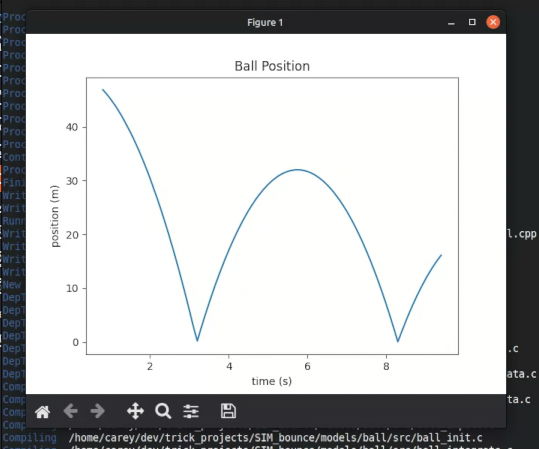

# SIM_bounce

## Overview

This is a project I've worked on to learn the basics of [NASA/Trick](https://github.com/nasa/trick). As of now it is a simple ball bouncing with no forces other than gravity acting on the ball. I've used matplotlib & python to make a real time plot showing the ball position over time by connecting to the trick server that can be run from the "clients/vs_plot.py" script. I will add more features over time to continue learning trick simulation tools. 


## Trick Concepts Demonstrated

- Job scheduling
- Job ordering
- Regula falsi event detection
- IntegLoop
- DRAscii data recording
- Variable server client (TCP socket connection)
- S_define
- LIBRARY_DEPENDENCY
- Real time data visualization
- subprocess sim lifecycle management (launching and terminating the sim from the client)


## Project structure

```
SIM_bounce/
├── S_define          - sim entry point, job scheduling
├── S_overrides.mk    - build configuration
├── RUN_test/         - test run configuration and output
├── Modified_data/    - data recording configuration
├── clients/
│   └── vs_plot.py    - live variable server plot client
└── models/ball/
    ├── include/ball.h         - struct definition and function declarations
    └── src/
        ├── ball_default_data.c
        ├── ball_init.c
        ├── ball_force.c
        ├── ball_integrate.c
        └── ball_impact.c
```

## Building

Requires NASA Trick installed and `TRICK_CFLAGS` configured via `S_overrides.mk`.

```bash
trick-CP
```


## Running

Run just the simulation:
```bash
./S_main_*.exe RUN_test/input.py
```

Run the live variable server plot (starts sim automatically):
```bash
python3 clients/vs_plot.py
```
Requires matplotlib: `pip3 install matplotlib`

Initial conditions can be modified in `RUN_test/input.py`.

## Screenshot




## Output

Simulation data is logged to `RUN_test/log_ball.csv` containing time, position, and velocity. Impact events are printed to stderr with exact impact time.
